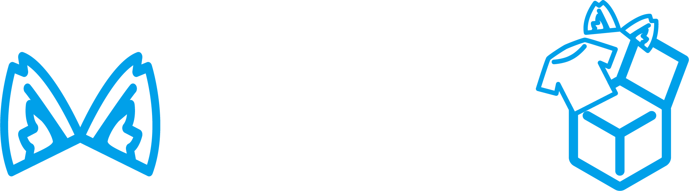

 [공식 홈페이지 튜토리얼 링크](https://modular-avatar.nadena.dev/docs/intro)

Modular Avatar는 주로 아바타에 의상이나 악세사리를 착용할 때 사용되는 패키지입니다.

## 시작하기
<Cards>
    <Card title="설치" href="/docs/modular-avatar/install">ALCOM에 Modular Avatar 패키지 VPM 추가하기</Card>
</Cards>
## 주요 컴포넌트
<Cards>
    <Card title="Setup Outfit" href="/docs/modular-avatar/setup-outfit">의상을 아바타 몸에 고정시키기</Card>
    <Card title="MA Bone Proxy" href="/docs/modular-avatar/ma-bone-proxy">헤어, 악세사리를 아바타 몸에 고정시키기</Card>
    <Card title="MA Object Toggle" href="/docs/modular-avatar/ma-object-toggle">옷 입었을 때 특정 오브젝트 끄기/켜기</Card>
    <Card title="MA Shape Changer" href="/docs/modular-avatar/ma-shape-changer">옷 입었을 때 특정 BlendShapes 변경하기</Card>
    <Card title="MA Blendshape Sync" href="/docs/modular-avatar/ma-blendshape-sync">신체와 옷의 쉐이프키 자동 동기화</Card>
</Cards>