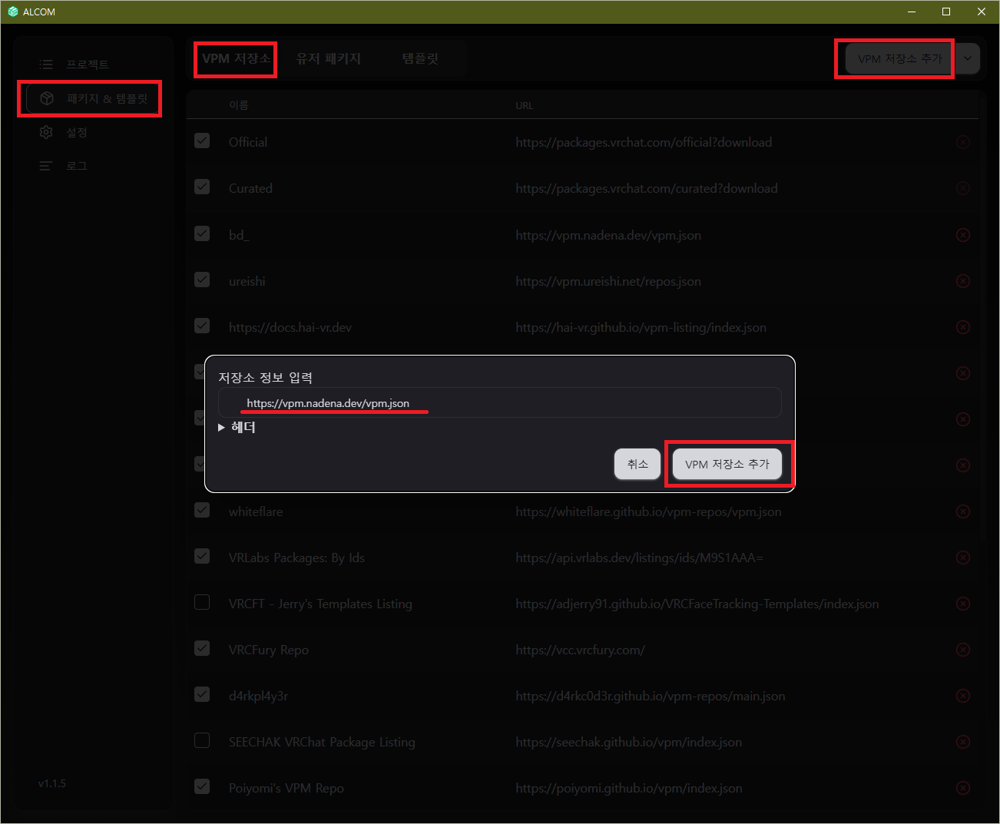
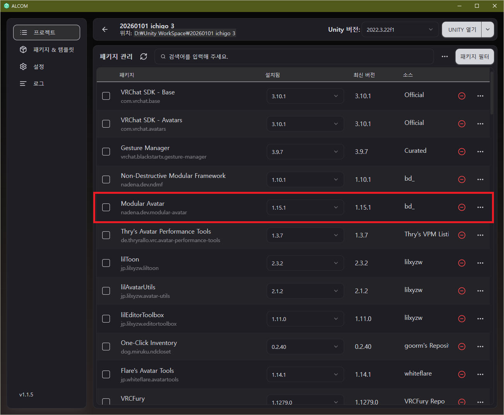

import {Step, Steps} from "fumadocs-ui/components/steps";
import {Accordions, Accordion} from "fumadocs-ui/components/accordion";

## 설치 방법

<Steps>
    <Step>
        ALCOM (또는 VCC) 실행
    </Step>
    <Step>
        '패키지 & 템플릿' > 'VPM 저장소' > 'VPM 저장소 추가' 클릭
    </Step>
    <Step>
        저장소 정보 입력 칸에 아래의 주소 입력

        ```
        https://vrc.community/packages/com.vrchat.vpm.modular-avatar/
        ```
    </Step>
    <Step>
        아래의 설명을 따라 패키지 추가
    </Step>
</Steps>
---
## 패키지 추가
        
아바타 프로젝트 관리 탭에서 `Modular Avatar` 패키지 추가
***