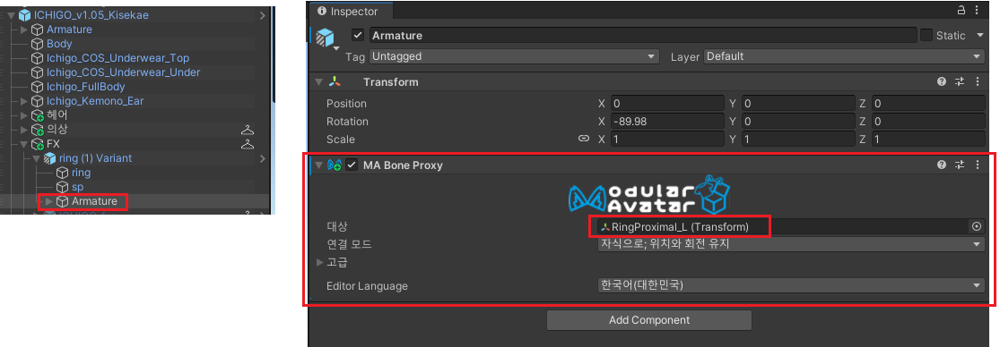

import {Accordions, Accordion} from "fumadocs-ui/components/accordion";

- Setup Outfit으로 착용되지 않는 일부 의상이나 헤어, 악세사리 등을 착용하고자 할 때 사용하는 기능입니다.
- 주로 공용으로 쓰이는 헤어, 귀걸이, 반지 등이 이 컴포넌트를 필요로 합니다.
- 에셋의 Armature가 Hips로 시작하면 [Setup Outfit](/docs/modular-avatar/setup-outfit)을 사용하고, 그 외에는 이 `MA Bone Proxy`를 사용한다고 볼 수 있습니다.
***

## 사용 방법

입히려는 헤어/악세사리의 Armature에 `MA Bone Proxy` 컴포넌트를 추가한 뒤, 부착하고 싶은 아바타의 본을 연결합니다.
<Accordions>
    <Accordion title={"적용 예시 영상"}>
        <video src="/videos/ma-bone-proxy-yes.mov" controls/>
    </Accordion>
</Accordions>
### 어떤 본을 찾아야 할 지 모르겠어요.
아바타의 어떤 본을 드래그 해 넣어야할 지 결정하기 어렵다면, 일반적으로 Armature 바로 하위에 있는 본 이름과 동일한 본을 찾으면 됩니다.
- 헤어는 보통 Armature 아래에 Hair_Root 본이 있는 경우가 많습니다.
    - 이 경우 아바타의 `Armature - Hips - Spine - Chest - Neck - Head - HairRoot` 를 찾아 드래그해서 넣어주면 됩니다.
- 악세사리는 착용 부위마다 다른데, 신체부위의 영문명만 알고 있다면 직감적으로 찾는게 어렵지 않습니다.
    - 예시 영상에서는 왼손 약지에 반지를 부착하기 위해 `Armature - Hips - Spine - Chest - ShoulderL (왼쪽 어깨) - UpperArm - LowerArm - Wrist - Hand - RingProximal (약지)` 를 골랐습니다.
- (참고) 신체 부위의 영문명은 아바타마다 조금씩 스펠링이 다를 수 있습니다.
    - 예: ShoulderL, Shoulder.L, Shoulder_L 등
***
## 이 컴포넌트를 필요로 하는 사례
<Accordions type="multiple">
    <Accordion title={"부스에서 산 헤어/악세사리를 입혔는데, 허공에 떠다녀요 ㅠㅠ"}>
        <Accordions>
            <Accordion title={"예시 영상 보기"}>
                <video src="/videos/ma-bone-proxy-no.mov" controls/>
            </Accordion>
        </Accordions>
        - `Setup Outfit` 또는 `MA Bone Proxy` 기능을 사용하지 않으면 반드시 일어나는 당연한 현상입니다.
    </Accordion>
    <Accordion title={"'Setup Outfit'을 시도했는데, 에러창이 떠요 ㅠㅠ"}>
        
        - 에셋의 Armature이 Hips로 시작하지 않는 경우에 해당 에러창이 뜹니다.
        - 이 경우에는 이 페이지의 `MA Bone Proxy` 컴포넌트를 이용해 직접 본을 매핑해주는 것이 정석입니다.
    </Accordion>

</Accordions>
***
