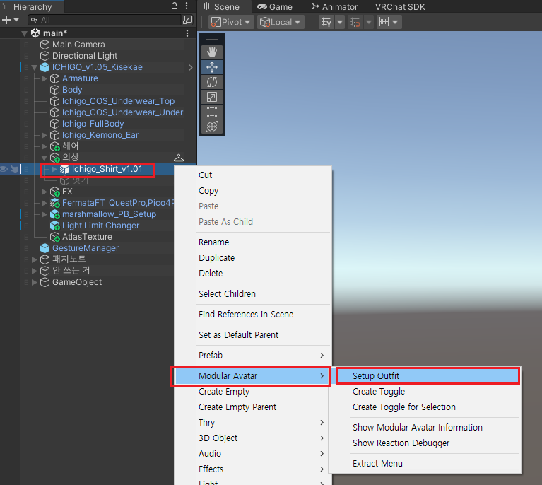
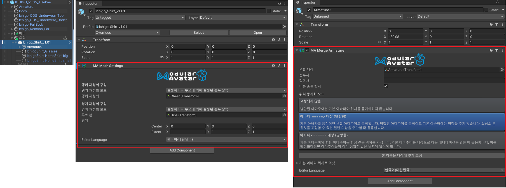
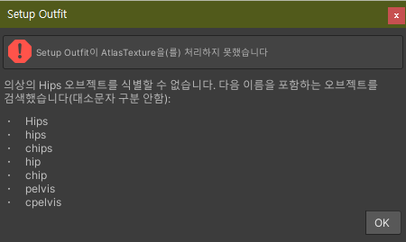

import {Accordions, Accordion} from "fumadocs-ui/components/accordion";

- 의상을 아바타에 착용시킬 때에 사용하는 기능입니다.
- 부스에서 구매한 의상이 허공에 고정되며 내 아바타의 팔다리를 따라오지 않는 경우에 사용할 수 있습니다.
***
## 사용 방법
입히려는 의상에 `우클릭`하여 `Modular Avatar` - `Setup Outfit` 버튼을 눌러 아바타에 착용 세팅을 간편하게 할 수 있습니다.

<Accordions>
    <Accordion title={"적용 예시 영상"}>
        <video src="/videos/setup_outfit_yes.mov" controls/>
    </Accordion>
</Accordions>
### 적용 결과 확인

Setup Outfit이 정상적으로 적용되면 다음과 같은 컴포넌트가 추가됩니다.
1. 의상 게임오브젝트에 `MA Mesh Settings` 컴포넌트가 추가됨
2. 의상의 Armature에 `MA Merge Armature` 컴포넌트가 추가됨

***
## 이 컴포넌트를 필요로 하는 사례
>
<Accordions type="multiple">
    <Accordion title={"부스에서 산 의상을 입혔는데, 옷만 허공에 떠다녀요 ㅠㅠ"}>
        <Accordions>
            <Accordion title={"예시 영상 보기"}>
                <video src="/videos/setup_outfit_no.mov" controls/>
                - Setup Outfit 기능을 사용하지 않으면 반드시 일어나는 당연한 현상입니다.
                - 영상 하단의 Project 탭에 보이는 것처럼 `MA` 라고 적힌 프리팹이 같이 제공되는 경우도 있는데, 이 프리팹은 Setup Outfit을 비롯해 기믹이 적용된 프리팹이므로 가급적 `MA`가 표기된 프리팹을 사용하는 것을 권장합니다.
            </Accordion>
        </Accordions>
    </Accordion>
</Accordions>
***
## FAQ
<Accordions type="multiple">
    <Accordion title={"Setup Outfit 누르면 에러가 떠요 ㅠㅠ"}>
        
        입히려는 의상/헤어/악세사리의 Armature가 Hips 기준으로 되어있지 않기 때문입니다. [MA Bone Proxy](/docs/modular-avatar/ma-bone-proxy) 페이지를
        참고하세요.
    </Accordion>
</Accordions>
***
일반적으로 의상 프리팹을 꺼내 아바타에 넣은 뒤에 필수로 해줘야하는 작업입니다. 과거에는 의상 Armature에 있던 본들을 일일히 아바타 Armature에 집어넣어야 했지만, 이제는 모듈식으로 조립하는 추세이기 때문에 강력히 권장되는 에셋 착용 방식입니다.

***